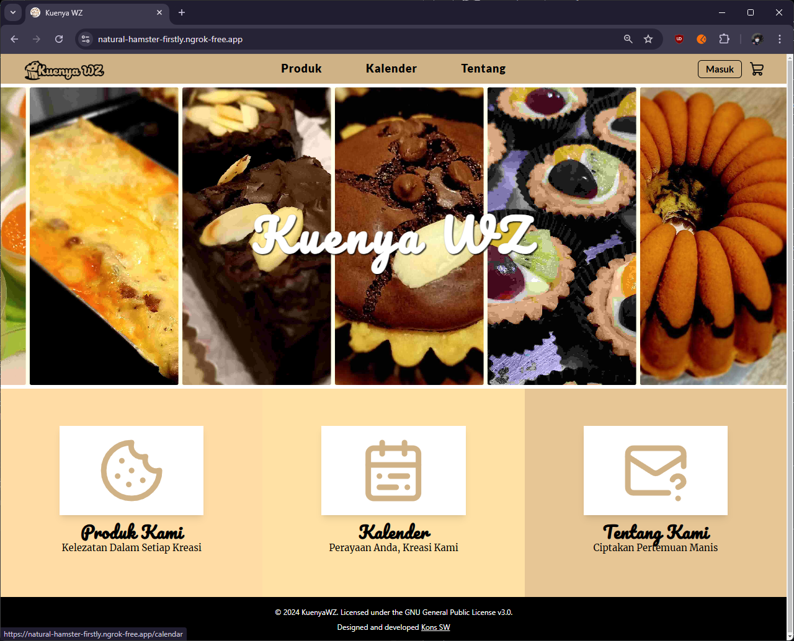

# Kuenya WZ Website

A web application composed of React user interface with connection to our Spring RESTful API.

## API Documentation

Please refer to the server's section.

## Preview Domains

Uses Ngrok:

- Front-End: https://natural-hamster-firstly.ngrok-free.app
- Back-End: https://turkey-glad-orca.ngrok-free.app/

## Preview Pictures

|                                             |                                           |
|---------------------------------------------|-------------------------------------------|
|                 |         |
|                |                 |
|         |       |
|           |  |
|       |         |
|  |  |

## Contributors

- **[@vianneynara](https://github.com/vianneynara)** (Nara)
- **[@trustacean](https://github.com/Trustacean)** (Edward)
- **[@ZeroFairy](https://github.com/ZeroFairy)** (Jordan)
- **[@FatDog98](https://github.com/FatDog98)** (Patrick)
- **[@hersa37](https://github.com/hersa37)** (Hersa)
